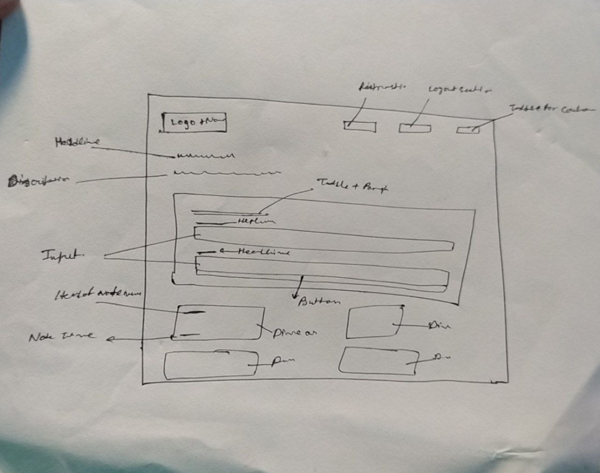

# 📝 Quick Notes App

A clean and minimal **To-Do based Notes App** built using **HTML, CSS, and JavaScript** — inspired by real-world productivity needs!

## 🎯 Features

- 🌓 Light & Dark Mode Toggle
- 📌 Pin Notes for quick access
- 🗑️ Delete notes with a single click
- ✏️ Edit & rewrite notes instantly
- 💾 LocalStorage support — saves notes even after refresh
- 🎨 Beautiful, user-friendly UI based on a paper sketch layout

## 🖼️ UI Design

Inspired by my hand-drawn wireframe and brought to life with code!

> 🧠 From concept to creation — this sketch was the blueprint that shaped the entire app!

## 🚀 Live Demo

👉 [View Live on GitHub Pages](https://utkarsh-webdev.github.io/Quick-notes-app/)

## 🔧 Tech Stack

- HTML5
- CSS3 (Custom theme palette)
- Vanilla JavaScript
- LocalStorage API

## 📦 How to Use

1. Clone or download the repository
2. Open `index.html` in your browser
3. Start writing, saving, and managing notes!

---

## 📣 What's Special?

This project showcases not just my coding skills but also:

- 🧠 My design-to-code thinking process
- 🎯 UX/UI decisions based on real use cases
- 🎨 Ability to convert wireframes into a working app
- 💡 Clean, responsive layout that adapts to light & dark modes

---

## 🙋‍♂️ Let's Connect

If you liked this project or want to collaborate, feel free to connect:

🔗 [LinkedIn - Utkarsh Jha](https://www.linkedin.com/in/jhautkarsh27)  
📧 [Email Me](mailto:utkarshjha832@gmail.com)

---

⭐ **Star this repo** if you find it useful and want to support my journey!
